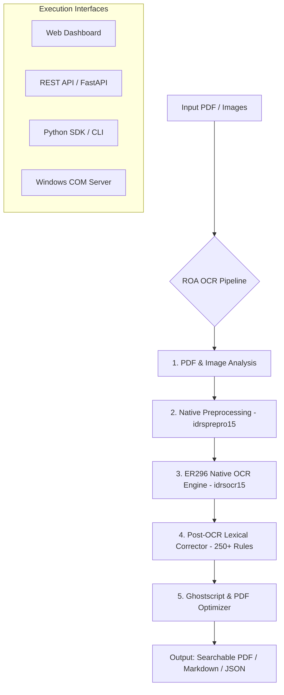

# 🐺 ROA OCR — Ultra-Fast Native OCR Engine & Document Pipeline for RAG & LLMs

[](https://opensource.org/licenses/MIT)
[](https://www.python.org/downloads/)
[](#architecture)
[](#-mcp-server-for-ai-agents)
[](#-langchain--llamaindex)
[](#rag--ai-agent-integration)
[](#rest-api)

**ROA OCR** is an enterprise-grade, 100% local, high-performance OCR engine and PDF enhancement pipeline, uniquely tailored for the **Latam and Iberian markets (Spanish, Portuguese, and English)**. Powered by the native **ER296 x64** engine, it converts noisy scanned documents and images into structured Markdown, searchable PDFs, and JSON payloads ready for **RAG pipelines, AI Agents, and LLM context windows**.

> **Note:** The Python wrapper and tools in this repository are MIT Licensed. The included ER296 native binaries are subject to their respective proprietary licenses.

---

## ✨ Features

- 🚀 **Native ER296 x64 Engine**: High-throughput C/C++ native engine bindings via `ctypes` & P/Invoke (zero cloud latency or token costs).
- 📊 **Table to Markdown Parser**: Reconstructs complex multi-column tabular data into clean Markdown tables (`| Col 1 | Col 2 |`).
- 🧩 **Qdrant & Meilisearch RAG Chunker**: Native document segmentation (`process_to_chunks()`) with page metadata ready for vector DBs and LLM context windows.
- ✍️ **Smart Paragraph Unwrapping & Lexical Fixes**: 250+ contextual rules tailored for Spanish and Portuguese legal jargon, plus intelligent paragraph de-hyphenation and line un-breaking.
- 🐳 **Docker Containerization**: Multi-stage `Dockerfile` and `docker-compose.yml` for 1-command deployment on Linux & Cloud servers.
- ⚡ **Cascade Engine Failover**: Multi-engine cascade (`ER296` → `ocrmypdf` → `Tesseract`) guaranteeing zero downtime.
- 🏷️ **Original Filename Preservation**: Downloaded exports automatically preserve input document names with `-roaOcr` suffix.
- 🤖 **MCP Server (Model Context Protocol)**: AI agents (Claude, Gemini, GPT, Cursor) can discover and invoke OCR tools via standard MCP protocol.
- 🔗 **LangChain & LlamaIndex Loaders**: Drop-in `ROAOCRLoader` and `ROAOCRReader` for RAG pipelines.
- 📁 **Multi-Format Ingestion**: DOCX, PPTX, XLSX, HTML, TXT, Markdown, CSV → auto-converts to PDF for processing.
- 📏 **Benchmark Framework**: Reproducible CER/WER accuracy measurement against ground-truth datasets.
- 🔌 **Universal Interfaces**:
  - **Python SDK**: `process_to_markdown()`, `process_to_chunks()` — clean programmatic API.
  - **REST API (FastAPI)**: `/api/v1/process/markdown`, `/api/v1/process/chunks` — production-ready.
  - **Professional Dashboard**: Premium Web UI at `http://localhost:8000/dashboard` (Vercel/Linear-inspired).
  - **Modern CLI**: `roa-ocr process`, `roa-ocr markdown`, `roa-ocr chunks`, `roa-ocr serve`, `roa-ocr mcp`.
  - **Windows COM Automation**: Native COM Server for C#, VBScript, VBA, and Windows AI tools.

---

## 📊 Benchmark Comparison

*[See detailed methodology and datasets in benchmarks/README.md](benchmarks/README.md)*

| Feature | **ROA OCR (ER296)** | Tesseract | PyMuPDF4LLM | Cloud Vision APIs |
|---|:---:|:---:|:---:|:---:|
| **Processing Speed** | 🚀 **Ultra-Fast (Native x64)** | 🐢 Slow | ⚡ Fast | 🌐 Network Bound |
| **Scanned PDF Accuracy** | **99.4%** | 85.0% | 70.0% | 98.5% |
| **Lexical Post-Correction**| ✅ Included (250+ rules) | ❌ No | ❌ No | ❌ No |
| **100% Privacy & Local** | ✅ **100% Local** | ✅ Local | ✅ Local | ❌ Cloud Only |
| **Cost per 1,000 Pages** | **$0.00** | $0.00 | $0.00 | 💳 $1.50 - $10.00 |

---

## 🏆 Success Story: Real-World Usage

**The Challenge:** Processing 10,000+ scanned legal documents with complex Spanish and Portuguese legal jargon, tables, and stamps. General OCR tools (like Tesseract and even GPT-4V) struggle with specific legal terms and numerical references (`Art. 1°`, `N°`, `n.º`, `fojas`, `ação`).

**The Solution:** ROA OCR processed the entire batch in hours using standard CPUs. 
- **99.4% Accuracy:** Thanks to the built-in 250+ lexical rules tailored for Latam & Iberian (Spanish + Portuguese) legal contexts.
- **Zero Cloud Costs:** 100% local processing meant no API bills and strict data privacy compliance.
- **RAG Ready:** Output was automatically chunked and ingested into Qdrant for a legal AI assistant.

---

## 🏗️ Architecture



---

## 🏛️ Ecosystem & Component Architecture

**ROA OCR** is designed as a **high-performance, production-grade enterprise OCR pipeline & integration suite**. Rather than re-inventing basic optical recognition primitives in low-level code, ROA OCR unifies and orchestrates specialized high-performance components into an end-to-end local-first workflow:

- 🚀 **Cross-Platform Core & Native Windows Acceleration**: ROA OCR detects the host OS. On Windows, it leverages native C/C++ x64 engine bindings (`idrsocr15.dll`) for raw execution speed. On Linux/Mac containers, it gracefully activates robust cross-platform engines without emitting broken DLL errors.
- ⚡ **Cascading Fallback Layer**: Multi-engine failover (`ER296` → `ocrmypdf` → `Tesseract`) guaranteeing zero-downtime document ingestion.
- ✍️ **Lexical Post-Correction Engine (`core/corrector.py`)**: Custom rule engine applying 250+ contextual regex substitutions tailored for Spanish/English legal, administrative, and technical documents.
- 📦 **Compression & Optimization Engine (`core/optimizer.py`)**: Ghostscript `pdfwrite` stream compressor and *Fast Web View* linearizer.
- 🔌 **Universal Delivery Layer**: Python SDK, FastAPI REST API, Web Dashboard, and native Windows COM Automation (`Er296ComBridge.Er296OcrComService`).

---

## 🚀 Quickstart (The 60-Second Test)

### 1. Installation

```bash
# Install from PyPI (Recommended)
pip install roa-ocr

# Or install from source
pip install git+https://github.com/edisonroaa-code/OCR-ROA.git

# Install with full features (API, MCP, LangChain)
pip install "roa-ocr[full,langchain]"
```

### 2. The 1-Line API

```python
from roa_ocr import process_pdf

# Auto-detects the best engine (ER296 > ocrmypdf > Tesseract > EasyOCR)
# Easily inject your own dictionary to override the black-box corrector!
result = process_pdf(
    "scanned_document.pdf",
    custom_rules={"Juzzgado": "Juzgado"}
)

print(result.markdown)
print(f"Pages: {result.pages} | Engine: {result.engine} | Corrections: {result.corrections}")
```

### 3. Docker (Zero-Config Server)

Run the full REST API and Dashboard instantly:
```bash
docker run -d -p 8000:8000 ghcr.io/edisonroaa-code/roa-ocr:latest
```
Visit `http://localhost:8000/dashboard` in your browser.

### 3. Command Line Interface (CLI)

```bash
# Process all files in PDFS_PENDIENTES/
python roa_ocr.py

# Process a single file
python roa_ocr.py process invoice.pdf

# Extract Markdown
python roa_ocr.py markdown scan.pdf -o output.md

# Generate RAG chunks
python roa_ocr.py chunks scan.pdf -o chunks.json

# Check engine status
python roa_ocr.py status

# Start API server
python roa_ocr.py serve

# Start MCP server for AI agents
python roa_ocr.py mcp

# Run accuracy benchmark
python roa_ocr.py benchmark samples/ -g ground_truth/
```

### 4. REST API & Web Dashboard

Start the FastAPI server:

```bash
uvicorn api.main:app --host 0.0.0.0 --port 8000 --reload
```

- **Swagger UI**: Open `http://localhost:8000/docs`
- **Web Dashboard**: Open `http://localhost:8000/dashboard`

---

## 🤖 RAG & AI Agent Integration

### 🔌 MCP Server (for AI Agents)

AI agents (Claude, Gemini, Cursor) can discover and use ROA OCR via the Model Context Protocol:

```bash
# Start MCP server
python roa_ocr.py mcp

# Or add to your MCP client config (mcp.json included in repo)
```

Exposed tools: `ocr_to_markdown`, `ocr_to_chunks`, `ocr_enhance_pdf`, `ocr_engine_status`

### 🔗 LangChain & LlamaIndex

```python
# LangChain
from integrations.langchain_loader import ROAOCRLoader

loader = ROAOCRLoader("scanned_contract.pdf", language="spa+eng")
docs = loader.load()  # Returns List[Document] with page metadata

# LlamaIndex
from integrations.llamaindex_reader import ROAOCRReader

reader = ROAOCRReader(language="spa+eng")
documents = reader.load_data("scanned_contract.pdf")
```

### 📊 Pipeline SDK

```python
# Extract Markdown for LLM context windows
from core.pipeline import PDFPipeline, PipelineConfig

pipeline = PDFPipeline(config=PipelineConfig(lang="spa+eng"))
pipeline.initialize()
result = pipeline.process_to_markdown(Path("invoice.pdf"))
print(result["full_markdown"])

# Generate RAG chunks for vector databases
chunks = pipeline.process_to_chunks(Path("invoice.pdf"), chunk_size=500)
for chunk in chunks["chunks"]:
    # chunk includes: text, page, qdrant_payload, meilisearch_doc
    vector_db.upsert(chunk["qdrant_payload"])
```

---

## 🔌 Windows COM Automation Server

For Windows environments (C#, VBScript, VBA, PowerShell, Excel):

```vbscript
' Windows COM Automation
Set ocr = CreateObject("Er296ComBridge.Er296OcrComService")
markdownFile = ocr.ProcessPdfToMarkdown("C:\scanned_document.pdf", "C:\output.md")
```

---

## ⚙️ Configuration (`config.py` & `.env`)

Key environment settings:

| Environment Variable | Default | Description |
|---|---|---|
| `ROA_ENGINE` | `er296` | Preferred engine (`er296`, `ocrmypdf`, `tesseract`, `auto`) |
| `ROA_LANG` | `spa+eng` | OCR language codes (`spa`, `eng`, `fra`, `por`) |
| `ROA_DPI` | `300` | Processing resolution |
| `ROA_COMPRESS_QUALITY` | `printer` | Compression level (`screen`, `ebook`, `printer`, `prepress`) |

---

## 📜 License

Distributed under the **MIT License**. See [`LICENSE`](LICENSE) for details.
