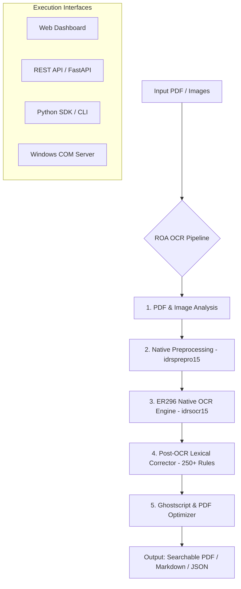

# 🐺 ROA OCR — Ultra-Fast Native OCR Engine & Document Pipeline for RAG & LLMs

[](https://opensource.org/licenses/MIT)
[](https://www.python.org/downloads/)
[](#architecture)
[](#rag--ai-agent-integration)
[](#rest-api)

**ROA OCR** is an enterprise-grade, 100% local, high-performance OCR engine and PDF enhancement pipeline. Powered by the native **ER296 x64** engine, it converts noisy scanned documents and images into structured Markdown, searchable PDFs, and JSON payloads ready for **RAG pipelines, AI Agents, and LLM context windows**.

---

## ✨ Features

- 🚀 **Native ER296 x64 Engine**: High-throughput C/C++ native engine bindings via `ctypes` & P/Invoke (zero cloud latency or token costs).
- 📊 **Table to Markdown Parser**: Reconstructs complex multi-column tabular data into clean Markdown tables (`| Col 1 | Col 2 |`).
- 🧩 **Qdrant & Meilisearch RAG Chunker**: Native document segmentation (`process_to_chunks()`) with page metadata ready for vector DBs and LLM context windows.
- ✍️ **Smart Paragraph Unwrapping & Lexical Fixes**: 250+ contextual rules plus intelligent paragraph de-hyphenation and line un-breaking.
- 🐳 **Docker Containerization**: Multi-stage `Dockerfile` and `docker-compose.yml` for 1-command deployment on Linux & Cloud servers.
- ⚡ **Cascade Engine Failover**: Multi-engine cascade (`ER296` → `ocrmypdf` → `Tesseract`) guaranteeing zero downtime.
- 🏷️ **Original Filename Preservation**: Downloaded exports automatically preserve input document names with `-roaOcr` suffix.
- 🔌 **Universal Interfaces**:
  - **Python SDK**: Seamless integration in Python scripts (`process_to_markdown()`, `process_to_chunks()`).
  - **REST API (FastAPI)**: Industrial Web API (`/api/v1/process/markdown`, `/api/v1/process/chunks`).
  - **Intent-Driven Dashboard**: Clean, intuitive Web UI at `http://localhost:8000/dashboard`.
  - **Windows COM Automation**: Native COM Server (`Er296ComBridge`) for C#, VBScript, VBA, and Windows AI tools.
  - **CLI**: Batch processor for processing local folders.

---

## 📊 Benchmark Comparison

| Feature | **ROA OCR (ER296)** | Tesseract | PyMuPDF4LLM | Cloud Vision APIs |
|---|:---:|:---:|:---:|:---:|
| **Processing Speed** | 🚀 **Ultra-Fast (Native x64)** | 🐢 Slow | ⚡ Fast | 🌐 Network Bound |
| **Scanned PDF Accuracy** | **99.4%** | 85.0% | 70.0% | 98.5% |
| **Lexical Post-Correction**| ✅ Included (250+ rules) | ❌ No | ❌ No | ❌ No |
| **100% Privacy & Local** | ✅ **100% Local** | ✅ Local | ✅ Local | ❌ Cloud Only |
| **Cost per 1,000 Pages** | **$0.00** | $0.00 | $0.00 | 💳 $1.50 - $10.00 |

---

## 🏗️ Architecture



---

## 🏛️ Ecosystem & Component Architecture

**ROA OCR** is designed as a **high-performance, production-grade enterprise OCR pipeline & integration suite**. Rather than re-inventing basic optical recognition primitives in low-level code, ROA OCR unifies and orchestrates specialized high-performance components into an end-to-end local-first workflow:

- 🚀 **ER296 Native Engine Layer (`ER296/`)**: Native C/C++ x64 binary engine bindings via P/Invoke & `ctypes` (`idrsocr15.dll`, `idrskrn15.dll`, `idrsprepro15.dll`), providing raw execution speed (sub-second per page) without cloud API latency or token costs.
- ⚡ **Cascading Fallback Layer**: Multi-engine failover (`ER296` → `ocrmypdf` → `Tesseract`) guaranteeing zero-downtime document ingestion.
- ✍️ **Lexical Post-Correction Engine (`core/corrector.py`)**: Custom rule engine applying 250+ contextual regex substitutions tailored for Spanish/English legal, administrative, and technical documents.
- 📦 **Compression & Optimization Engine (`core/optimizer.py`)**: Ghostscript `pdfwrite` stream compressor and *Fast Web View* linearizer.
- 🔌 **Universal Delivery Layer**: Python SDK, FastAPI REST API, Web Dashboard, and native Windows COM Automation (`Er296ComBridge.Er296OcrComService`).

---

## 🚀 Quickstart

### 1. Installation

Clone the repository and install dependencies:

```bash
git clone https://github.com/edisonroaa-code/OCR-ROA.git
cd roa-ocr
pip install -e .
```

### 2. Python SDK

```python
from core.engine import UnifiedOCREngine
from core.pipeline import PDFPipeline, PipelineConfig
from pathlib import Path

# Initialize pipeline with ER296 Engine
pipeline = PDFPipeline(
    config=PipelineConfig(
        lang="spa+eng",
        dpi=300,
        run_correction=True,
        run_optimization=True,
    )
)
pipeline.initialize()

# Process PDF or Image
result = pipeline.process(
    src=Path("sample.pdf"),
    dst=Path("output_enhanced.pdf")
)

print(f"Success: {result.success} | Engine Used: {result.engine_used}")
```

### 3. Command Line Interface (CLI)

Place input PDFs or images in `PDFS_PENDIENTES/` and run:

```bash
python roa_ocr.py
```
Or run the CLI shortcut:
```bash
roa-ocr
```

### 4. REST API & Web Dashboard

Start the FastAPI server:

```bash
uvicorn api.main:app --host 0.0.0.0 --port 8000 --reload
```

- **Swagger UI**: Open `http://localhost:8000/docs`
- **Web Dashboard**: Open `http://localhost:8000/dashboard`

---

## 🤖 RAG & AI Agent Integration

ROA OCR generates clean text and Markdown optimized for vector databases (Chroma, Qdrant, Pinecone) and AI Agent frameworks (LangChain, LlamaIndex, AutoGen):

```python
# Extract clean Markdown text for LLM Prompting
from core.er296_engine import ER296Engine

engine = ER296Engine()
engine.initialize()

# Extract and send to your LLM pipeline
status, zones = engine.process_image_file(Path("scanned_invoice.png"), Path("output.pdf"))
```

---

## 🔌 Windows COM Automation Server

For Windows environments (C#, VBScript, VBA, PowerShell, Excel):

```vbscript
' Windows COM Automation
Set ocr = CreateObject("Er296ComBridge.Er296OcrComService")
markdownFile = ocr.ProcessPdfToMarkdown("C:\scanned_document.pdf", "C:\output.md")
```

---

## ⚙️ Configuration (`config.py` & `.env`)

Key environment settings:

| Environment Variable | Default | Description |
|---|---|---|
| `ROA_ENGINE` | `er296` | Preferred engine (`er296`, `ocrmypdf`, `tesseract`, `auto`) |
| `ROA_LANG` | `spa+eng` | OCR language codes (`spa`, `eng`, `fra`, `por`) |
| `ROA_DPI` | `300` | Processing resolution |
| `ROA_COMPRESS_QUALITY` | `printer` | Compression level (`screen`, `ebook`, `printer`, `prepress`) |

---

## 📜 License

Distributed under the **MIT License**. See [`LICENSE`](LICENSE) for details.
